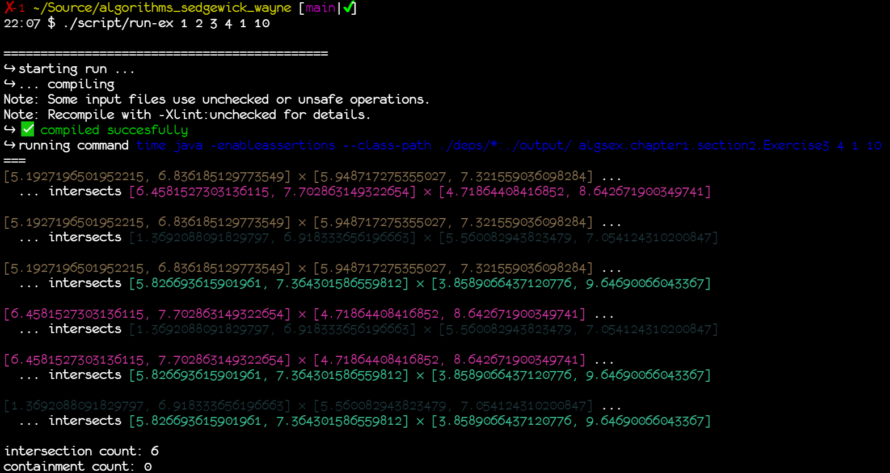

[](https://github.com/nicooga/algorithms_sedgewick_wayne/actions/workflows/main.yml)
# Solved exercises for "Algorithms" by R. Sedgewick and K. Wayne

This is a collection of solved exercises for the book "Algorithms" by Robert Sedgewick and Kevin Wayne.
Most of them come in the form of executable Java code, and some as Markdown docs.

## Java version used

I wrote and tested the exercises using the following Java version:

> $ java -version  
> openjdk version "17" 2021-09-14
> OpenJDK Runtime Environment (build 17+35-2724)
> OpenJDK 64-Bit Server VM (build 17+35-2724, mixed mode, sharing)

## Helper scripts

In order to aid me in working with the book, I created a [series of scripts](https://github.com/nicooga/algorithms_sedgewick_wayne/tree/main/script).

You can run a single exercise by running `./script/run-ex <chapter> <section> <exercise> [arg1] [arg2] [...]`. For instance:



## This project is tested

In order to test that these exercise solutions compile and work, I've set up some primitive automated tests using Java assertions, Docker and Github actions.

These tests mostly involve just calling the main() method of all exercises, sometimes simulating the needed input for these to work. 

You can run them locally like this:

```bash
$ run algsex.MainTest
```

This testing is not the best, but should give us some confidence that the code in this project works.