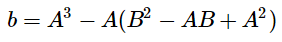
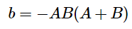

> 1.4.26 3-collinearity. Suppose that you have an algorithm that takes as input N dis-
> tinct points in the plane and can return the number of triples that fall on the same line.
> Show that you can use this algorithm to solve the 3-sum problem. Strong hint : Use
> algebra to show that (a, a^3), (b, b^3), and (c, c^3) are collinear if and only if a + b + c = 0.

Given 2 points `(A, A^3)` and `(B, B^3)` we can define a linear function `f` that these points lay on.
If a third point `(C, C^3)` is collinear with the other two, `f(C) = C^3` must have a solution.

First, we need to define `f`. The slope for this function -`a`- is equal to `(B^3 - A^3)/(B - A)`. 
Through some work we can simplify this to `a = B^2 - BA + A^2`.

Then, we can derive the y-intercept of the function -`b`- from a one of the points:

  
  

which simplifies to:

  

Having found the slope and y-intercept of `f`, we can finally find a solution for `f(C) = C^3`.

  
  
  

This expression factors into the following product:

  

We can now derive 3 solutions. Either `C = A`, `C = B` or `A + B + C = 0` are solutions for this equation.
The first two cases are not relevant, since `C` being equal to `A` or `B` would mean that we are comparing points that are identical.

Now, an algorithm for the three-sum problem that takes advantage of this fact would look like this:

- take a list of N integers `{N1, N2, N, ... Nn}`
- build a list of N points `{(N1, N1^3), (N2, N2^3), ... (Nn, N^3)}`
- find the number of triples within this list of points that are collinear and return it