1.4.6 Give the order of growth (as a function of N ) of the running times of each of the following code fragments:  

a.
~~~java
int sum = 0;

for (int n = N; n > 0; n /= 2)
    for(int i = 0; i < n; i++)
        sum++;
~~~

b.
~~~java
int sum = 0;

for (int i = 1; i < N; i *= 2)
    for (int j = 0; j < i; j++)
        sum++;
~~~

c.
~~~java
int sum = 0;

for (int i = 1; i < N; i *= 2)
    for (int j = 0; j < N; j++)
         sum++;
~~~

Answers:

a. Short answer: `O(N)`  

Long answer: The frequency of execution of the main loop can be expressed by:

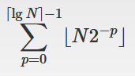

... which we can simplify by removing flooring, ceiling and superfluous constants:

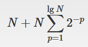

Also:

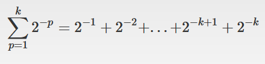  
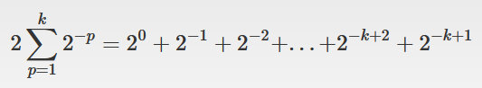  
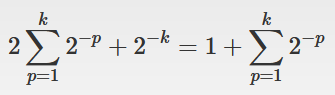  
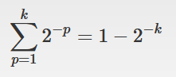  

So we can further simplify the first expression to:

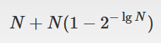  
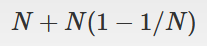  
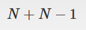  
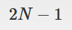  

... which finally means that the order of growth of this code is just `O(N)`.

b. Short answer: `O(N)`  

Long answer: The frequency of execution of the main main loop can be expressed by:  

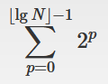  

... which looks familiar to me because is a way we can express the value of a binary number of length `floor(lg(N))` and comprised of only "1" digits.  

A binary number of length `L` comprised of only ones is always equal to `2^L  - 1`.
For example: `111` in binary is `2^0 + 2^1 + 2^2 = 7`, which is also `2^3 - 1`.

So we can replace the orignal formula with just:

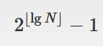  

... which for the purpose of algorithm complexity analysis is the same as:

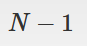  

So this code fragment has `O(N)` complexity.

c. Short answer: `O(N*log(N))`

Long answer: the frequency of execution of the main loop can be expressed as:

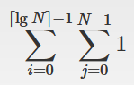  

... which after a little of massaging can be simplified to:

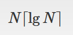  

This proves that this code fragment has linearithmic complexity.