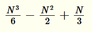

1.4.7 Analyze ThreeSum under a cost model that counts arithmetic operations (and
comparisons) involving the input numbers.

~~~java
public class ThreeSum {
    public static int count(int[] a) {
        int N = a.length;
        int cnt = 0;

        for (int i = 0; i < N; i++) // i is incremented N-1 times
            for (int j = i+1; j < N; j++) // for each sdasdi, j is incremented (N-1) - (i + 1) times
                for (int k = j+1; k < N; k++) // for each j, k is incremented (N - 1) - (j + 1) times
                    if (a[i] + a[j] + a[k] == 0) // for each k, 3 sums and and one comparison ocur
                        cnt++; // depends on the number of triples found

        return cnt;
    }

    public static void main(String[] args) {
        int[] a = In.readInts(args[0]);
        StdOut.println(count(a));
    }
}
~~~

Let's assume that "operations" includes increments to counter variables like `i`.

The `int i` variable is incremented `N` times.

The `int j` variable is incremented `(N - i - 1)` times for each value of `i`, which goes from `0` to `N - 1`:

  
  

Working out this expression gives us:

 

The `int k` variable is incremented `(N - i - 1)` times for each value of `k` and `i`. `a[i] + a[j] + a[k] == 0` means 2 sum operations and a comparison for the same amount of times. This is the same as saying '4 sum operations are performed for each iteration of the main loop".

We can calculate the frequency of execution of the main loop by working out this expression:

 

... which after a lot of massaging gives us:

.

Summing up all these expressions for a grand total gives us:

  

Finally, for each matching triple, the operation `cnt++` is executed. We can just sum this value `x` to the expression to account for that.

`Exercise7.java` whithin this same folder uses an instrumented version of `ThreeSum` and a few test cases to confirm this expression is correct.