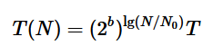

1.4.9 Give a formula to predict the running time of a program for a problem of size N
when doubling experiments have shown that the doubling factor is 2b and the running
time for problems of size N0 is T.

We know that `T(2N)/T(N) = 2^b`, which implies that `T(2N) = T(N) * 2^b`. So:

| N     | T(N)                      |
|-------|---------------------------|
| N0    | T                         |
| 2 N0  | 2^b * T                   |
| 4 N0  | 2^b * 2^b * T             |
| 8 N0  | 2^b * 2^b * 2^b * T       |
| 16 N0 | 2^b * 2^b * 2^b * 2^b * T |

So `T(N)` can be expressed as:

... which can be simplified to:

