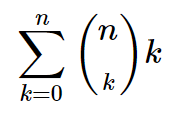
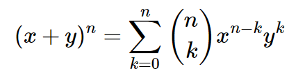
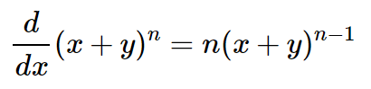
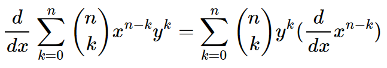
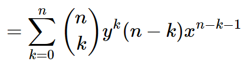
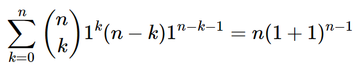
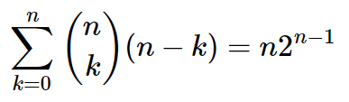
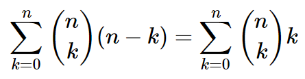
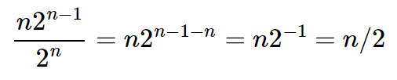

> 1.5.15 Binomial trees. Show that the number of nodes at each level in the worst-case
> trees for weighted quick-union are binomial coefficients. Compute the average depth of
> a node in a worst-case tree with N = 2^n nodes.

### Amount of nodes at each level

As explained in [Ex. 1.5.9](./Exercise9.md), in order to reach some depth `d`, we need at least two threes of depth `d-1`.

In the worst case tree, we minimize the nodes needed to reach the next depth level, in order to maximize the depth.
Consider this progression, starting from `N` zero-depth trees:

~~~
* * * * * * * *
~~~

In order to reach depth 1, we need to merge two single nodes:

~~~
*
|
*
~~~

Then, to reach depth 2 we need another tree like the one we just created:

~~~
  *
 /|
* *
|
*
~~~

This happens consistently at all levels. In order to reach the next depth level `d` we need two `d-1` depth trees.

Reaching depth 3:
~~~
    ----*
   /   /|
  *   * *
 /|   |
* *   *
|
*
~~~

Reaching depth 4:
~~~
          --------*
         /   /   /|
    ----*   *   * *
   /   /|  /|   |
  *   * * * *   *
 /|   |   |
* *   *   *
|
*
~~~

Then one of the trees root will point to the remaining one and its nodes will all gain one level of depth.
Because of this, the amount of nodes at each level will follow a recursive pattern.
In a tree of depth `d`, the amount of nodes at each level `l` is going to be equal to the amount of nodes in a tree of depth `d-1` at the same level `l` and at level `l-1`, or more succintly:

~~~
C(d, l) = C(d-1, l) + C(d-1, l-1)
~~~

This recursive definition is the same as for binomial coefficients, given these base cases:

~~~
C(d, 0) = 1
C(d, l) = 0 when l < 0 or l > d
(floors are zero-indexed)
~~~

This shows why the amount of nodes at each level in a tree of `2^n` nodes are binomial coefficients.

### Average depth

Given the following facts:

- the number of levels for a worst-case tree with size `2^n` is `n + 1`
- each level `k` has `(n k)` (binomial coefficient) nodes

Then, the sum of depths is:

  

This sum is known to be equal to `n*2^(n-1)`. This fact becomes apparent after taking the derivative of the binomial theorem, then substituting `x=y=1` ([1]):

  
  
  
  

At this point we can replace `x` and `y`:

  

... and finally:

  

This expression iterates in reverse order by multiplying by `(n-k)` instead of `k`. But, since binomial coefficients are symmetric we can iterate in reverse order and obtain the same result, so we can safely say these are equal:

  

[1]: https://en.wikipedia.org/wiki/Binomial_coefficient#Sums_of_the_binomial_coefficients

Now, in order to obtain the average node depth we only need to divide the sum of the depths by the number of nodes:

  

__Conclusion:__
The average node depth in a worse case tree generated by union-find via weighted quick-union is `n/2`.